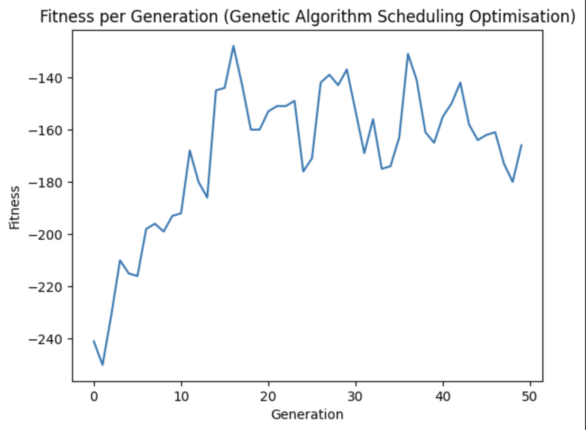
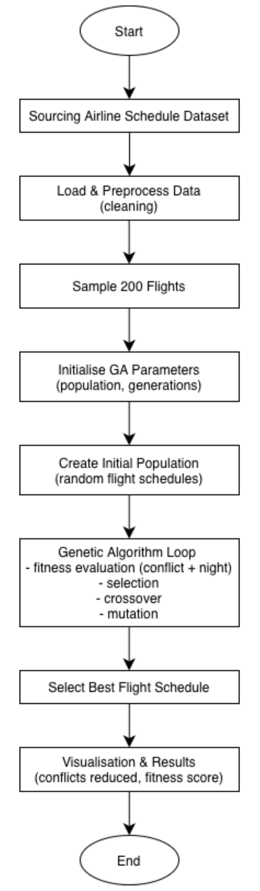

# Airline Flight Scheduling Optimisation Using Genetic Algorithms

Genetic Algorithm optimisation of airline flight schedules using 113,339 real-world flight records to minimise airport slot conflicts and improve schedule quality.

### Overview

This project explores the application of **Artificial Intelligence and evolutionary optimisation** to airline flight scheduling. Using over **113,000 real-world airline records**, a **Genetic Algorithm (GA)** was developed to optimise flight departure schedules, reduce airport slot conflicts, and improve overall schedule quality.

The project demonstrates the complete AI workflow, from data preparation and feature engineering through to algorithm design, optimisation, testing, and performance evaluation.

<p align="center">
  
</p>

<p align="center">
  <em>Figure 1: Fitness improvement across 50 generations showing optimisation progress of the Genetic Algorithm.</em>
</p>

### Project Objectives

The aim of this project was to investigate how Genetic Algorithms can be applied to complex transportation scheduling problems by:

* Optimising airline departure schedules
* Reducing airport slot conflicts
* Minimising undesirable departure times
* Improving schedule efficiency through evolutionary search
* Evaluating the effectiveness of AI-driven optimisation techniques

### Dataset

The project uses the **Indian Domestic Airline Dataset**, containing real airline scheduling information.

**Dataset Summary**

* **113,339 flight records**
* **14 airlines**
* **100+ origin airports**
* **100+ destination airports**
* Scheduled departure and arrival times
* Flight routes and operating days

Following data cleaning and preprocessing, **35,541 valid flight records** were retained for optimisation.

**Data Preparation**

Key preprocessing steps included:

* Handling missing values
* Removing irrelevant attributes
* Converting time-based variables into numerical features
* Feature engineering for departure and arrival hours
* Generating operational scheduling variables

### Methodology

Three Artificial Intelligence approaches were researched and evaluated:

1. Genetic Algorithms (GA)
2. Constraint Satisfaction Problems (CSP)
3. Heuristic Scheduling Methods

A **Genetic Algorithm** was selected due to its ability to efficiently search large solution spaces and handle complex scheduling constraints.

### Genetic Algorithm Workflow

<p align="center">
  
</p>

<p align="center">
  <em>Figure 2: End-to-end workflow showing data preparation, genetic algorithm optimisation and schedule evaluation.</em>
</p>

### Fitness Function

The optimisation objective was to minimise:

* Airport slot conflicts
* Congestion caused by overlapping departures
* Undesirable departure times (before 06:00 and after 22:00)

Schedules with fewer conflicts and better time allocations received higher fitness scores.

### Implementation

The solution was developed in **Python** using a custom Genetic Algorithm implementation.

**Technologies Used**

* Python
* Pandas
* NumPy
* Matplotlib
* Jupyter Notebook
* Google Colab

** Algorithm Configuration

| Parameter       | Value |
| --------------- | ----- |
| Population Size | 20    |
| Generations     | 50    |
| Mutation Rate   | 0.05  |
| Random Seed     | 42    |

The optimisation process utilised tournament selection, uniform crossover, and mutation operators to evolve increasingly efficient scheduling solutions.

### Results

The Genetic Algorithm successfully improved scheduling performance throughout the optimisation process.

**Key Outcomes**

* Reduced airport slot conflicts
* Improved departure time allocation
* Stable optimisation convergence
* Effective exploration of alternative scheduling solutions

**Performance Improvement**

The best fitness score improved from approximately:

* Initial Fitness: **-250**
* Final Fitness: **-130**

This represents an improvement of approximately **52% in schedule quality** across 50 generations.

### Key Skills Demonstrated

This project showcases practical experience in:

* Artificial Intelligence
* Genetic Algorithms
* Evolutionary Computing
* Optimisation Techniques
* Data Cleaning & Preprocessing
* Feature Engineering
* Python Development
* Data Analysis & Visualisation
* Problem Solving
* Performance Evaluation

### Repository Structure

```text
├── data/
│   └── Air_full-Raw.csv
├── images/
│   └── workflow_diagram.png
│   └── fitness_progression.png
├── README.md
├── airline_scheduling_genetic_algorithm.ipynb
└── requirements.txt

```

### Future Improvements

Potential future enhancements include:

* Aircraft maintenance constraints
* Weather disruption modelling
* Fuel consumption optimisation
* Carbon emissions minimisation
* Multi-objective optimisation
* Real-time schedule adaptation

### Running the Project

1. Clone the repository

```bash
git clone https://github.com/elisa0228/airline-flight-scheduling-genetic-algorithm.git
```

2. Install dependencies

```bash
pip install -r requirements.txt
```

3. Download the colab notebook and open in Google Colab and run all cells

   
### Project Highlights

*Real-world airline dataset (113k+ records)*

*End-to-end AI optimisation workflow*

*Custom Genetic Algorithm implementation*

*Feature engineering and preprocessing pipeline*

*52% improvement in schedule quality*

*Demonstrates practical AI application in transportation and operations research*
